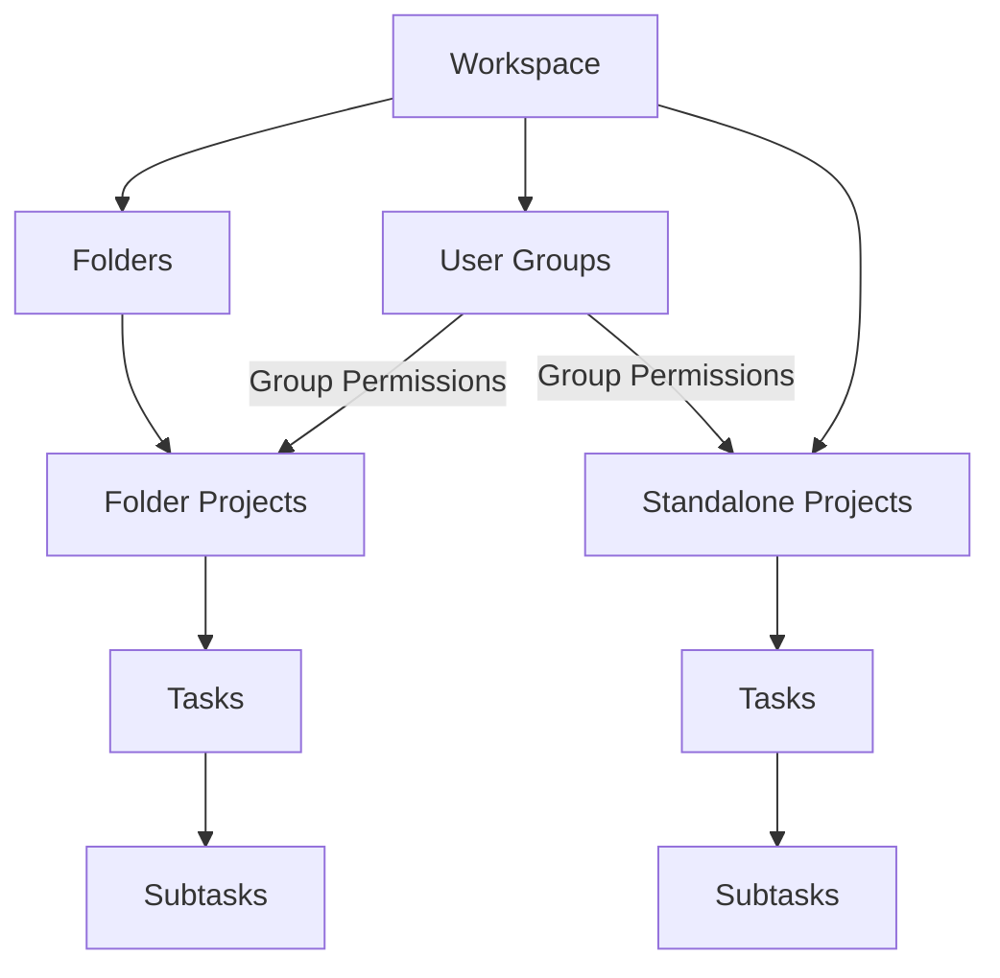
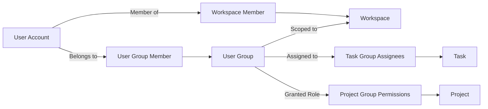

# Bathyal Architecture and Domain Model Documentation

This document formalizes the domain concepts, organizational hierarchy, user management model, Role-Based Access Control (RBAC) rules, and relational database schema for the Bathyal project management platform.

---

## 1. Domain Concept Hierarchy

Bathyal structures work across a four-level hierarchy designed for multi-tenancy and dynamic view scoping.



### 1.1 Workspace
* **Definition:** The top-level multi-tenant boundary and organizational root. Every entity (folders, projects, tasks, custom fields, documents, time logs, and groups) belongs strictly to a single workspace.
* **Responsibilities:**
  * Defines tenant boundaries and scopes all user access.
  * Owns global custom field definitions, global statuses, and audit logs.
  * Governs member roles (`owner`, `admin`, `member`, `guest`).
* **Modes:**
  * **Personal Workspace (`is_personal = true`):** A lightweight single-user workspace tailored for simple to-do tracking with hidden enterprise controls.
  * **Enterprise Workspace (`is_personal = false`):** A collaborative multi-user organization supporting nested folders, team groups, Gantt auto-scheduling, and granular RBAC.

### 1.2 Folder
* **Definition:** An intermediate categorization container located inside a Workspace.
* **Responsibilities:**
  * Groups related projects under a functional, departmental, or client-based scope (e.g., "Engineering", "Design & UX", "Marketing Campaigns", "Q3 Deliverables").
  * Does not contain tasks directly; it contains Projects.
  * Provides visual structure, ordering (`position`), and inherited access boundaries for nested projects.

### 1.3 Project
* **Definition:** The discrete execution unit where work is planned, coordinated, and executed.
* **Responsibilities:**
  * Can reside inside a Folder or exist as a standalone project directly under a Workspace.
  * Owns an isolated collection of Tasks, custom status workflows, milestone due dates, Gantt dependencies, and block documentation.
  * Configured with visual branding (`icon`, `color_hex`) and template flags (`is_template`).

### 1.4 Task & Subtask
* **Definition:** The atomic work item representing an actionable deliverable.
* **Responsibilities:**
  * Contains title, rich description, status, priority, estimated hours, start date, and due date.
  * Supports infinite hierarchical nesting via `parent_id` for subtasks.
  * Supports multiple assignees (both individual users and user groups).
  * Stores dynamic attribute values via the Custom Fields EAV engine.

---

## 2. User Accounts and User Groups Model



### 2.1 User Account (`users`)
* **Definition:** An individual authenticated identity in the system.
* **Attributes:**
  * `id`: Unique user identifier.
  * `email`: Unique login identifier.
  * `password_hash`: Bcrypt hash with salt.
  * `full_name`: Display name.
  * `default_mode`: UI landing preference (`simple` or `enterprise`).
  * `created_at`: Registration timestamp.

### 2.2 User Group / Team (`user_groups`)
* **Definition:** A named collection of users within a Workspace representing a functional team, department, or squad (e.g., "Frontend Developers", "DevOps", "Product Managers", "Tier 2 Support").
* **Key Capabilities:**
  1. **Group-Level Access Control:** Folders and Projects can grant read/write permissions directly to a User Group rather than managing users individually.
  2. **Group Task Assignment:** Tasks can be assigned directly to an entire group via `task_group_assignees`.
  3. **Inherited Membership:** Adding a user to a group immediately grants them access to all projects and tasks assigned to that group.

---

## 3. Role-Based Access Control (RBAC) Matrix

| Permission | Owner | Admin | Member | Guest |
|---|:---:|:---:|:---:|:---:|
| **Workspace Settings & Billing** | Yes | No | No | No |
| **Manage Workspace Members & Groups** | Yes | Yes | No | No |
| **Create / Delete Folders & Projects** | Yes | Yes | No | No |
| **Create & Edit Tasks** | Yes | Yes | Yes | No |
| **View Assigned Projects & Tasks** | Yes | Yes | Yes | Yes |
| **Delete Tasks** | Yes | Yes | Creator Only | No |
| **Log Time & Add Comments** | Yes | Yes | Yes | No |

---

## 4. Relational Database Schema (MySQL 8.0)

```sql
-- 1. Users & Core Authentication
CREATE TABLE users (
    id BIGINT UNSIGNED AUTO_INCREMENT PRIMARY KEY,
    email VARCHAR(255) NOT NULL UNIQUE,
    password_hash VARCHAR(255) NOT NULL,
    full_name VARCHAR(150) NOT NULL,
    default_mode ENUM('simple', 'enterprise') DEFAULT 'simple',
    created_at TIMESTAMP DEFAULT CURRENT_TIMESTAMP
) ENGINE=InnoDB DEFAULT CHARSET=utf8mb4 COLLATE=utf8mb4_0900_ai_ci;

-- 2. Workspaces
CREATE TABLE workspaces (
    id BIGINT UNSIGNED AUTO_INCREMENT PRIMARY KEY,
    name VARCHAR(255) NOT NULL,
    slug VARCHAR(100) NOT NULL UNIQUE,
    is_personal BOOLEAN DEFAULT FALSE,
    created_at TIMESTAMP DEFAULT CURRENT_TIMESTAMP,
    updated_at TIMESTAMP DEFAULT CURRENT_TIMESTAMP ON UPDATE CURRENT_TIMESTAMP
) ENGINE=InnoDB DEFAULT CHARSET=utf8mb4 COLLATE=utf8mb4_0900_ai_ci;

CREATE TABLE workspace_members (
    workspace_id BIGINT UNSIGNED NOT NULL,
    user_id BIGINT UNSIGNED NOT NULL,
    role ENUM('owner', 'admin', 'member', 'guest') DEFAULT 'member',
    PRIMARY KEY (workspace_id, user_id),
    CONSTRAINT fk_wm_workspace FOREIGN KEY (workspace_id) REFERENCES workspaces (id) ON DELETE CASCADE,
    CONSTRAINT fk_wm_user FOREIGN KEY (user_id) REFERENCES users (id) ON DELETE CASCADE
) ENGINE=InnoDB DEFAULT CHARSET=utf8mb4 COLLATE=utf8mb4_0900_ai_ci;

-- 3. User Groups / Teams
CREATE TABLE user_groups (
    id BIGINT UNSIGNED AUTO_INCREMENT PRIMARY KEY,
    workspace_id BIGINT UNSIGNED NOT NULL,
    name VARCHAR(100) NOT NULL,
    slug VARCHAR(100) NOT NULL,
    description TEXT NULL,
    color_hex VARCHAR(7) DEFAULT '#6366F1',
    created_at TIMESTAMP DEFAULT CURRENT_TIMESTAMP,
    UNIQUE KEY uq_group_slug (workspace_id, slug),
    CONSTRAINT fk_ug_workspace FOREIGN KEY (workspace_id) REFERENCES workspaces (id) ON DELETE CASCADE
) ENGINE=InnoDB DEFAULT CHARSET=utf8mb4 COLLATE=utf8mb4_0900_ai_ci;

CREATE TABLE user_group_members (
    group_id BIGINT UNSIGNED NOT NULL,
    user_id BIGINT UNSIGNED NOT NULL,
    created_at TIMESTAMP DEFAULT CURRENT_TIMESTAMP,
    PRIMARY KEY (group_id, user_id),
    CONSTRAINT fk_ugm_group FOREIGN KEY (group_id) REFERENCES user_groups (id) ON DELETE CASCADE,
    CONSTRAINT fk_ugm_user FOREIGN KEY (user_id) REFERENCES users (id) ON DELETE CASCADE
) ENGINE=InnoDB DEFAULT CHARSET=utf8mb4 COLLATE=utf8mb4_0900_ai_ci;

-- 4. Folders & Projects
CREATE TABLE folders (
    id BIGINT UNSIGNED AUTO_INCREMENT PRIMARY KEY,
    workspace_id BIGINT UNSIGNED NOT NULL,
    name VARCHAR(255) NOT NULL,
    position INT DEFAULT 0,
    CONSTRAINT fk_folders_workspace FOREIGN KEY (workspace_id) REFERENCES workspaces (id) ON DELETE CASCADE
) ENGINE=InnoDB DEFAULT CHARSET=utf8mb4 COLLATE=utf8mb4_0900_ai_ci;

CREATE TABLE projects (
    id BIGINT UNSIGNED AUTO_INCREMENT PRIMARY KEY,
    workspace_id BIGINT UNSIGNED NOT NULL,
    folder_id BIGINT UNSIGNED NULL,
    name VARCHAR(255) NOT NULL,
    description TEXT NULL,
    icon VARCHAR(50) DEFAULT 'list',
    color_hex VARCHAR(7) DEFAULT '#4A90E2',
    is_template BOOLEAN DEFAULT FALSE,
    created_at TIMESTAMP DEFAULT CURRENT_TIMESTAMP,
    CONSTRAINT fk_projects_workspace FOREIGN KEY (workspace_id) REFERENCES workspaces (id) ON DELETE CASCADE,
    CONSTRAINT fk_projects_folder FOREIGN KEY (folder_id) REFERENCES folders (id) ON DELETE SET NULL
) ENGINE=InnoDB DEFAULT CHARSET=utf8mb4 COLLATE=utf8mb4_0900_ai_ci;

-- 5. Tasks & Assignees
CREATE TABLE tasks (
    id BIGINT UNSIGNED AUTO_INCREMENT PRIMARY KEY,
    workspace_id BIGINT UNSIGNED NOT NULL,
    project_id BIGINT UNSIGNED NULL,
    parent_id BIGINT UNSIGNED NULL,
    status_id BIGINT UNSIGNED NOT NULL,
    title VARCHAR(255) NOT NULL,
    description LONGTEXT NULL,
    priority ENUM('none', 'low', 'medium', 'high', 'urgent') DEFAULT 'none',
    start_date DATETIME NULL,
    due_date DATETIME NULL,
    estimated_hours DECIMAL(6,2) NULL,
    position INT DEFAULT 0,
    created_by BIGINT UNSIGNED NOT NULL,
    created_at TIMESTAMP DEFAULT CURRENT_TIMESTAMP,
    updated_at TIMESTAMP DEFAULT CURRENT_TIMESTAMP ON UPDATE CURRENT_TIMESTAMP,
    INDEX idx_tasks_ws_pos (workspace_id, position),
    INDEX idx_tasks_proj_status (project_id, status_id),
    INDEX idx_tasks_due_date (due_date),
    CONSTRAINT fk_tasks_workspace FOREIGN KEY (workspace_id) REFERENCES workspaces (id) ON DELETE CASCADE,
    CONSTRAINT fk_tasks_project FOREIGN KEY (project_id) REFERENCES projects (id) ON DELETE CASCADE,
    CONSTRAINT fk_tasks_parent FOREIGN KEY (parent_id) REFERENCES tasks (id) ON DELETE CASCADE,
    CONSTRAINT fk_tasks_creator FOREIGN KEY (created_by) REFERENCES users (id)
) ENGINE=InnoDB DEFAULT CHARSET=utf8mb4 COLLATE=utf8mb4_0900_ai_ci;

CREATE TABLE task_assignees (
    task_id BIGINT UNSIGNED NOT NULL,
    user_id BIGINT UNSIGNED NOT NULL,
    PRIMARY KEY (task_id, user_id),
    CONSTRAINT fk_ta_task FOREIGN KEY (task_id) REFERENCES tasks (id) ON DELETE CASCADE,
    CONSTRAINT fk_ta_user FOREIGN KEY (user_id) REFERENCES users (id) ON DELETE CASCADE
) ENGINE=InnoDB DEFAULT CHARSET=utf8mb4 COLLATE=utf8mb4_0900_ai_ci;

CREATE TABLE task_group_assignees (
    task_id BIGINT UNSIGNED NOT NULL,
    group_id BIGINT UNSIGNED NOT NULL,
    PRIMARY KEY (task_id, group_id),
    CONSTRAINT fk_tga_task FOREIGN KEY (task_id) REFERENCES tasks (id) ON DELETE CASCADE,
    CONSTRAINT fk_tga_group FOREIGN KEY (group_id) REFERENCES user_groups (id) ON DELETE CASCADE
) ENGINE=InnoDB DEFAULT CHARSET=utf8mb4 COLLATE=utf8mb4_0900_ai_ci;
```

---

## 5. Task Dependencies and Schedule Automation Architecture

### 5.1 Why Task Dependencies are Used
In real-world project planning and complex work streams, tasks do not exist in isolation. Task Dependencies serve several critical functions:
1. **Precedence and Workflow Enforcement:** Certain deliverables strictly require prerequisite deliverables to be completed first (e.g., *Database Schema Design* must be finalized before *Backend API Implementation* can begin).
2. **Automated Timeline Propagation (AutoScheduler):** When a blocking task experiences delays or changes duration, all linked downstream tasks automatically cascade and shift forward or backward across the calendar, eliminating tedious manual date recalculations.
3. **Critical Path Identification (CPM):** Task dependency networks form a Directed Acyclic Graph (DAG), enabling the calculation of Early Start ($ES$), Late Finish ($LF$), and Total Slack ($TS$). Tasks with zero float/slack represent the Critical Path—the sequence of bottleneck tasks determining the shortest possible project completion duration.
4. **Deadlock & Cycle Prevention:** The dependency engine prevents circular logic loops (e.g., Task A depends on Task B, which depends on Task A) using topological sorting (Kahn's algorithm) before changes are committed to the database.

### 5.2 The 4 Dependency Linkage Types

| Type | Code | Description | Scheduling Rule |
|---|:---:|---|---|
| **Finish-to-Start** | `finish_to_start` | Task B cannot start until Task A finishes. This is the most common industry standard. | $Start_B \ge Due_A$ |
| **Start-to-Start** | `start_to_start` | Task B cannot start until Task A starts. Enables parallel streaming tasks. | $Start_B \ge Start_A$ |
| **Finish-to-Finish** | `finish_to_finish` | Task B cannot finish until Task A finishes. Synchronizes completion milestones. | $Due_B \ge Due_A$ |
| **Start-to-Finish** | `start_to_finish` | Task B cannot finish until Task A starts. Used for just-in-time handoffs. | $Due_B \ge Start_A$ |

### 5.3 Dependency Engine Lifecycle in Bathyal
1. **Validation & Cycle Detection (`AutoScheduler::wouldCreateCycle`):** When a user draws a dependency link, the engine tests the hypothetical graph using Kahn's topological sort. If a cycle is detected, HTTP 400 with a detailed error is returned.
2. **Persistence (`task_dependencies`):** Valid dependencies are stored with their `blocking_task_id`, `dependent_task_id`, and `dependency_type`.
3. **Downstream Rescheduling (`AutoScheduler::rescheduleFromTask`):** Upon dependency creation, task date shift, or duration change, the AutoScheduler traverses downstream dependencies and shifts dates according to the linkage rule.
4. **Visual Rendering:** The frontend renders interactive Bezier curves with directional arrows connecting the start/end points of the respective task bars on the Gantt timeline. Clicking any line allows instant deletion.

---

## 6. Centralized Priority System & Visual Coding

To maintain visual consistency across all views (Simple List, Simple Kanban, Enterprise Kanban, Task Table, Gantt Timeline, and Task Detail Drawer), task priorities are strictly defined in `public/js/core/priorities.js` and styled via design tokens in `public/css/style.css`.

| Priority Level | Rank | Light Theme (Text / BG) | Dark Theme (Text / BG) | Gantt Bar Color | Meaning & SLA |
|---|:---:|---|---|---|---|
| **Urgent** | 4 | `#ef4444` / `#fef2f2` | `#ef4444` / `rgba(239,68,68,0.15)` | `#ef4444` (Red) | Critical blocker / immediate resolution |
| **High** | 3 | `#f59e0b` / `#fffbeb` | `#f59e0b` / `rgba(245,158,11,0.15)` | `#f59e0b` (Amber) | Key milestone / current sprint priority |
| **Medium** | 2 | `#0ea5e9` / `#f0f9ff` | `#38bdf8` / `rgba(56,189,248,0.15)` | `#0ea5e9` (Sky Blue) | Standard priority work item |
| **Low** | 1 | `#64748b` / `#f1f5f9` | `#94a3b8` / `rgba(148,163,184,0.15)` | `#64748b` (Slate Gray) | Nice-to-have / backlog backlog |
| **None** | 0 | `#94a3b8` / Transparent | `#64748b` / Transparent | No Color (Neutral Bar) | Unspecified priority |

---

## 7. RESTful API Reference for Groups & Dependencies

### User Groups
* `GET /api/v1/user-groups?workspace_id={id}` — List all user groups in a workspace.
* `POST /api/v1/user-groups` — Create a new user group.
* `GET /api/v1/user-groups/{id}` — Get single group details with active members list.
* `PATCH /api/v1/user-groups/{id}` — Update group name, description, or color.
* `DELETE /api/v1/user-groups/{id}` — Delete user group.
* `POST /api/v1/user-groups/{id}/members` — Add user to group.
* `DELETE /api/v1/user-groups/{id}/members/{userId}` — Remove user from group.
* `POST /api/v1/tasks/{id}/group-assignees` — Assign or unassign task to a user group.

### Dependencies
* `GET /api/v1/dependencies?workspace_id={id}&project_id={id}` — List task dependencies with task titles.
* `POST /api/v1/dependencies` — Link tasks (with automatic cycle detection & downstream rescheduling).
* `DELETE /api/v1/dependencies/{id}` — Remove a dependency link.

